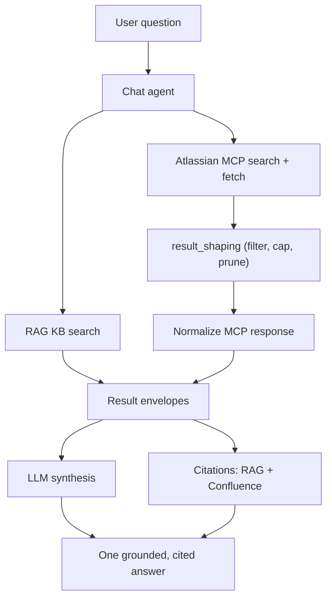

# Confluence as a live knowledge source

This guide wires the [Atlassian Rovo MCP Server](https://support.atlassian.com/atlassian-rovo-mcp-server/docs/getting-started-with-the-atlassian-remote-mcp-server/) into the agent so it can query live Confluence as a knowledge source *alongside* the built-in RAG knowledge base, and synthesize both into one grounded, cited answer.

Use this when your documentation lives in Confluence and changes often: the agent reads it live at query time, so you avoid re-ingesting content into the RAG index to keep it current.

## Prerequisites

- **An Atlassian API token** with Confluence **read + search** scopes. Create it via [Configuring authentication via API token](https://support.atlassian.com/atlassian-rovo-mcp-server/docs/configuring-authentication-via-api-token/). An under-scoped token still authenticates but exposes only the `getTeamworkGraph*` tools (see [Troubleshooting](#troubleshooting)).
- **Your `cloudId`** - the identifier of your Atlassian site.
- The stack running with the RAG index populated (see [Local Demo](../quickstarts/local.md) / [End-to-end setup](../quickstarts/end-to-end-setup.md)).

## Setup

Set two secrets in `.env`:

```bash
# base64("email:api_token")
ATLASSIAN_MCP_BASIC_AUTH=
ATLASSIAN_CLOUD_ID=
```

Then add the Atlassian server to `config.yaml` under `mcp_servers`. The block below is the shape; the full annotated version (description overrides and per-tool `result_shaping`) lives in [`config.yaml.example`](https://github.com/redis-applied-ai/redis-sre-agent/blob/main/config.yaml.example):

```yaml
mcp_servers:
  atlassian_rovo_mcp:
    url: "https://mcp.atlassian.com/v1/mcp"
    headers:
      Authorization: "Basic ${ATLASSIAN_MCP_BASIC_AUTH}"
    transport: streamable_http
    tools:
      # Read whitelist - only these search/fetch tools are exposed. Every Atlassian
      # write tool is filtered out because it is not listed here.
      searchAtlassian:
        capability: knowledge
        action_kind: read
        arg_defaults:
          cloudId: ${ATLASSIAN_CLOUD_ID}
      fetchAtlassian:
        capability: knowledge
        action_kind: read
        arg_defaults:
          cloudId: ${ATLASSIAN_CLOUD_ID}
      searchConfluenceUsingCql:
        capability: knowledge
        action_kind: read
        arg_defaults:
          cloudId: ${ATLASSIAN_CLOUD_ID}
      getConfluencePage:
        capability: knowledge
        action_kind: read
        arg_defaults:
          cloudId: ${ATLASSIAN_CLOUD_ID}
```

The building blocks used here - `capability`/`action_kind`, `arg_defaults`, description overrides, and `result_shaping` - are generic MCP features documented in the "MCP Server Integration" section of [Tool Providers](tool-providers.md).

After editing `config.yaml`/`.env`, restart so both containers pick up the change:

```bash
docker compose restart sre-agent sre-worker
```

!!! note "Access is not per-user scoped"
    This example uses a **single shared service identity** (the token above) for all requests, not per end user - so the agent can read whatever that one identity can read. If your deployment needs per-user access, you would map users to their own credentials; that is beyond what this example shows. Use a least-privilege, read-only token and keep it in `.env` (never commit it).

## How the agent uses both sources

Both the built-in RAG knowledge base and the whitelisted Confluence tools are tagged `capability: knowledge`, so the agent treats them as peers. For a documentation or troubleshooting question it consults **both** sources in the same turn and synthesizes a single grounded answer, with citations from each source. Confluence citations resolve to clickable page URLs.

Two things steer this behavior, both config-only (no code):

- **Description overrides** frame each Confluence tool as an *internal Redis SRE knowledge base* (using `{original}` to keep the upstream text), so the model sees it as a peer of the built-in KB rather than generic Atlassian search.
- **A knowledge-source prompt nudge** tells the model that when more than one knowledge source is available, it should consult a source from each and synthesize one cited answer - so it does not stop after the first hit.

You do not call anything special - ask a normal knowledge question and the agent federates across the sources automatically.

## Tuning retrieval quality

Live search returns many mixed, sometimes verbose results, so the shipped config curates them with the generic `result_shaping` knob (see the "Shaping tool results" section of [Tool Providers](tool-providers.md)):

- `searchAtlassian` spans all Atlassian products and has no server-side type/limit control, so it is scoped to `include_types: [page, blogpost]` and capped at `max_results: 8` - Confluence documents only, no Jira issues or CVEs in context or citations.
- `searchConfluenceUsingCql` returns verbose per-result metadata, so it uses `drop_fields` to prune those subtrees. It exposes a `limit` the model controls, so its description nudges a small page size (~10, at most 25) for the search-then-fetch pattern.

Query-formulation note: the description overrides steer the model toward plain natural-language queries for search (search operators like `site:` or `type:` are ignored by these tools).

## Verify it works

Ask a documentation question and confirm Confluence tools were called:

```bash
docker compose exec -T sre-agent uv run redis-sre-agent query \
  "What are common causes for CRDB sync issues?" --agent chat
```

The startup log line `Chat agent loaded N tools` confirms the Confluence tools were discovered. The `query` output ends with a `Decision trace: <id>` line; pass that id to `thread trace` to see which tools the turn actually called (and the citations):

```bash
docker compose exec -T sre-agent uv run redis-sre-agent thread trace <id> --json
```

To measure multi-source coverage and citation resolution across a question set, see [Knowledge Source Eval](knowledge-source-eval.md).

## Graceful degradation

If Confluence is slow, rate-limited, or unavailable, the agent still answers from the built-in RAG knowledge base - a Confluence outage degrades the answer rather than failing the turn.

## Troubleshooting

**`tools/list` shows only `getTeamworkGraph*` tools (no Confluence search/fetch).** The token is under-scoped. Recreate it with Confluence **read + search** scopes via [Configuring authentication via API token](https://support.atlassian.com/atlassian-rovo-mcp-server/docs/configuring-authentication-via-api-token/). Authenticating successfully is not enough - the presence of `searchConfluenceUsingCql`/`searchAtlassian` is the real check.

**The model asks the user for a `cloudId`.** Confirm `ATLASSIAN_CLOUD_ID` is set in `.env` and the container was restarted; `arg_defaults` injects it and hides it from the model only when it resolves to a concrete value.

**No Confluence citations appear.** Confirm the tools are tagged `capability: knowledge` in `config.yaml` (the default `utilities` capability would exclude them from the knowledge-citation path).

## Architecture


