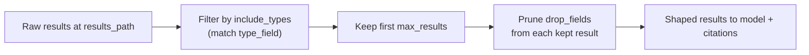

## Tool Providers: Overview & Extensibility

The agent exposes capabilities to the LLM via a provider system managed by ToolManager.

Out of the box, the agent can draw on Prometheus, Loki, Redis diagnostics, host telemetry, and optional MCP servers. The provider system is fully extensible, so you can map the agent onto your existing observability, admin, and ticketing systems without changing the core agent loop.

### What loads
- **Without an instance**: Knowledge base and basic utilities (date conversions, calculator)
- **With an instance**: All of the above plus the providers configured in `settings.tool_providers` (Prometheus, Loki, Redis CLI, Host Telemetry)
- **Conditional providers**: Additional providers based on instance type (e.g., Redis Enterprise admin API, Redis Cloud API)
- **MCP servers**: External tools from configured MCP servers (see below)

### Built-in providers
- **Prometheus metrics**: `redis_sre_agent.tools.metrics.prometheus.provider.PrometheusToolProvider`
  - Config: `TOOLS_PROMETHEUS_URL`, `TOOLS_PROMETHEUS_DISABLE_SSL`
- **Loki logs**: `redis_sre_agent.tools.logs.loki.provider.LokiToolProvider`
  - Config: `TOOLS_LOKI_URL`, `TOOLS_LOKI_TENANT_ID`, `TOOLS_LOKI_TIMEOUT`
- **Redis command diagnostics**: `redis_sre_agent.tools.diagnostics.redis_command.provider.RedisCommandToolProvider`
  - Runs Redis commands against target instances
- **Host telemetry**: `redis_sre_agent.tools.host_telemetry.provider.HostTelemetryToolProvider`
  - System-level metrics and diagnostics

Configure providers (environment override)
```bash
# JSON list override for settings.tool_providers
export TOOL_PROVIDERS='[
  "redis_sre_agent.tools.metrics.prometheus.provider.PrometheusToolProvider",
  "my_company.sre_tools.prometheus.PrometheusMetricsProvider"
]'
```

Per-instance configuration
- Place namespaced keys in RedisInstance.extension_data / extension_secrets for provider-specific config
- Providers can declare instance_config_model and read from the namespace matching provider_name (default) or extension_namespace

## Create a custom provider

Implement a ToolProvider subclass that defines tool schemas and resolves calls.

### Minimal skeleton

```python
from typing import Any, Dict, List
from redis_sre_agent.tools.protocols import ToolProvider
from redis_sre_agent.tools.models import ToolDefinition, ToolCapability


class MyMetricsProvider(ToolProvider):
    @property
    def provider_name(self) -> str:
        return "my_metrics"

    def create_tool_schemas(self) -> List[ToolDefinition]:
        return [
            ToolDefinition(
                name=self._make_tool_name("query"),
                description="Query my metrics backend using a query string.",
                capability=ToolCapability.METRICS,
                parameters={
                    "type": "object",
                    "properties": {"query": {"type": "string"}},
                    "required": ["query"],
                },
            )
        ]

    async def query(self, query: str) -> Dict[str, Any]:
        # Implement your backend call
        return {"status": "success", "query": query, "data": []}
```

The base class `tools()` method automatically wires tool names to provider methods. When an LLM invokes `my_metrics_{hash}_query`, the framework calls `self.query(**args)` directly. No manual `resolve_tool_call()` implementation is required.

### Register your provider

- Install your package into the same environment as the agent (e.g., `pip install -e /path/to/pkg`)
- Add your dotted class path to TOOL_PROVIDERS (see example above)

### Design guidelines

- Use descriptive names and rich descriptions (the LLM relies on them)
- Return structured results: `{"status": "success"|"error", ...}`
- Use `_make_tool_name("operation")` to generate unique, instance-scoped tool names
- Implement `get_status_update` via `@status_update` decorator for better UX

### Reference

- [Base class and protocols](https://github.com/redis-applied-ai/redis-sre-agent/blob/main/redis_sre_agent/tools/protocols.py)
- [Manager lifecycle and routing](https://github.com/redis-applied-ai/redis-sre-agent/blob/main/redis_sre_agent/tools/manager.py)
- [Built-in Prometheus provider](https://github.com/redis-applied-ai/redis-sre-agent/blob/main/redis_sre_agent/tools/metrics/prometheus/provider.py)

---

## MCP Server Integration

Add external MCP servers to give the agent additional tools. The agent connects to configured MCP servers at startup and discovers available tools automatically.

### Configuration

Add MCP servers in a config file. YAML is shown here because nested MCP configuration is easier to read in YAML:

```yaml
mcp_servers:
  # GitHub MCP server (HTTP transport - remote endpoint)
  github:
    url: "https://api.githubcopilot.com/mcp/"
    headers:
      Authorization: "Bearer ${GITHUB_PERSONAL_ACCESS_TOKEN}"

  # Local Docker MCP server
  github-local:
    command: docker
    args: ["run", "-i", "--rm", "-e", "GITHUB_PERSONAL_ACCESS_TOKEN", "ghcr.io/github/github-mcp-server"]
    env:
      GITHUB_PERSONAL_ACCESS_TOKEN: ${GITHUB_PERSONAL_ACCESS_TOKEN}
```

### Transport Types

- **stdio**: Launches a local process and communicates via stdin/stdout (default)
- **http/streamable_http**: Connects to a remote HTTP endpoint

### Tool Filtering

You can filter which MCP tools are exposed to the agent:

```yaml
mcp_servers:
  my-server:
    command: ...
    tools:
      # Only these tools will be available
      tool_name_1: {}
      tool_name_2:
        description: "Custom description for better LLM understanding"
```

If `tools` is not specified, all tools from the server are exposed.

### Excluding MCP Tool Categories

Use `exclude_mcp_categories` to exclude tools by capability:

```python
# In code
tool_manager = ToolManager(
    redis_instance=instance,
    exclude_mcp_categories=[ToolCapability.WRITE, ToolCapability.ADMIN]
)
```

### Customizing tool descriptions

Override a tool's description to steer how the model uses it, or use `{original}` to keep the server's own description and frame it with your own text. This is useful when an upstream description is generic and you want the model to treat the tool a specific way (for example, as a documentation source rather than generic search).

```yaml
mcp_servers:
  my-server:
    url: ...
    tools:
      search:
        # {original} expands to the server's own description; your text frames it.
        description: "Search the internal engineering knowledge base. {original}"
```

If you omit `{original}`, your text fully replaces the upstream description.

### Tool capability and action kind

Tag each MCP tool so the agent routes and gates it correctly:

- `capability` groups the tool into a category (`knowledge`, `metrics`, `tickets`, `repos`, and so on). MCP tools default to `utilities`, which tells the agent they are lightweight helpers. Set `capability: knowledge` on documentation/search tools so they are treated as a knowledge source and become eligible for citations.
- `action_kind: read` marks the tool as a safe read, so it is auto-allowed (no approval prompt) and cacheable.

```yaml
tools:
  search:
    capability: knowledge
    action_kind: read
```

### Pinning call-time arguments (arg_defaults)

Some tools require a fixed deployment identifier the model cannot know and should not choose - a cloud, tenant, account, or region id. `arg_defaults` supplies these at call time from your environment. When a value resolves to a concrete value it is removed from the tool's advertised schema (so the model never sees it or stalls asking the user for it) and injected on every call; unresolved placeholders are left in the schema so the model can still supply them.

```yaml
tools:
  search:
    arg_defaults:
      # Resolved from .env, hidden from the model, sent on every call.
      cloudId: ${ATLASSIAN_CLOUD_ID}
```

Values use the same `${VAR}` expansion as `headers` and `env`. This is generic - reuse it for any MCP tool that needs a pinned deployment argument.

### Shaping tool results (result_shaping)

Live search tools often return many mixed, verbose results - more than the model needs and noisier than you want in citations. `result_shaping` curates each result set on the client, before it reaches the model or citations. All fields are optional:

| Field | Effect |
|-------|--------|
| `include_types` | Keep only results whose type is in this list (drops out-of-scope kinds). |
| `max_results` | Cap the number of results (applied after `include_types`). |
| `drop_fields` | Remove these keys by name, at any depth, from each result to strip verbose metadata. |
| `results_path` | Top-level key holding the list of results (default `results`). Override if the tool nests its results under a different key. |
| `type_field` | Field on each result that `include_types` matches against (default `type`). Override if the tool names its kind field differently. |

The defaults for `results_path` and `type_field` fit most tools, so you usually only set `include_types`/`max_results`/`drop_fields`. If the tool's payload does not match `results_path` (key absent or not a list), shaping is a safe no-op.

```yaml
tools:
  search:
    result_shaping:
      include_types: [page, blogpost]              # keep docs, drop other kinds
      max_results: 8                               # cap the count
      drop_fields: [history, _links, _expandable]  # prune noisy metadata subtrees
```

Shaping is opt-in per tool: only tools that declare `result_shaping` are touched, and an unrecognized result shape is left unchanged (it never drops data on a mismatch).

The fields apply in a fixed order: filter, then cap, then prune.



See `config.yaml.example` for full YAML MCP configuration examples.
